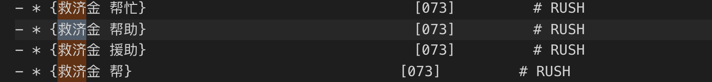
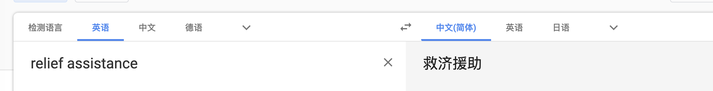
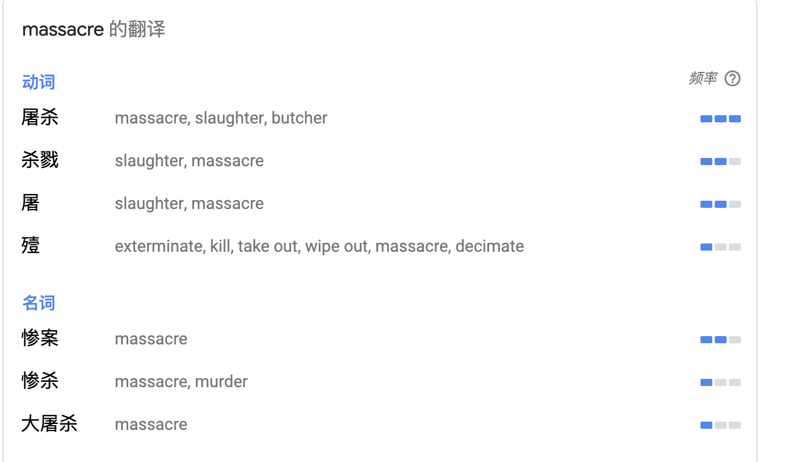

# 动词模式翻译问题

## +

以`+`开头的为动词词组，往往是例如wipe out, fight back, fight down等，这类词组唯有结合在一起翻译才有意义。用wordnet不一定能得到翻译结果；也不能单独翻译而进行单词组合，此时的组合几乎不能含有正确释义。

## ---

这里应该只有一个词，直接取任意一个翻译？

## &

### 目前做法

将该词当作普通词对待，不做特殊处理，但符号仍保留，以便校对

### 存在的问题

*不依赖同义词集则会出现缺漏的情况*

理论上讲应该读取源文件的同义词集，然后进行翻译加入。但部分词语不适合，如weapon，源文件中的同义词集含有大量武器型号词，如AK-47。且出现机器翻译难以获取正确词集的情况较多。

因此，纯机器翻译并加入这部分几乎没有意义，暂时未实现本部分涉及的功能。

解决方案设想：
先翻译同义词集，保留同义词集`&`开头的词，而后读取同义词集根据词语进行替换。

## 翻译不准确

词组采用每个词的翻译的笛卡尔积进行组合，但会出现拼凑仍无法得到正确翻译的情况。如`relief assistance`。

* wordnet翻译：



* Google翻译：



## 极少部分无法获得中文翻译

例如chant,中文意思为反复喊叫等。

```
---  MASSACRE   [202]  ---
BUTCHER
MASSACRE
SLAUGHTER
```

该块同样无法通过wordnet获取，但wordnet可给出英文同义词集。

Google翻译`massacre`一词结果如下：



## 总结

wordnet偏向字典化翻译，容易出现词语之间组合不通顺情况。且中文翻译不算全。